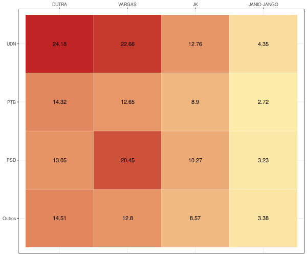
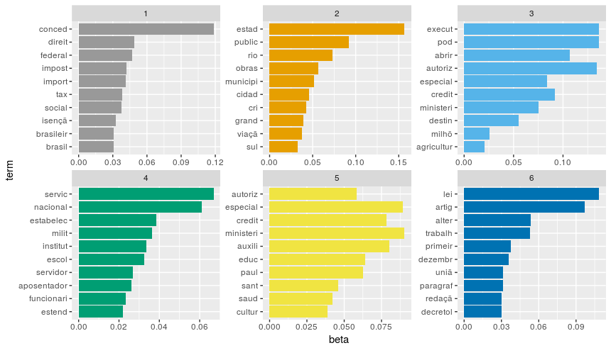

```{r setup, include=FALSE}
library(flexdashboard)
library(shinydashboard)
library(shiny)
library(ubeR)
library(tidyverse)
library(plotly)
library(tidyr)
library(readr)
library(magrittr)
library(ggthemes)
library(stringr)
library(zoo)
library(dygraphs)
library(xts)
library(rtweet)
library(quanteda)
library(tidytext)
library(DT)
library(rvest)
library(leaflet)
```

# Introduction {.sidebar}


Oi!

Meu nome é Nathan! Atualmente curso Ciências Sociais na Universidade de São Paulo e apesar de ser um curso de humanas adoro tecnologia e exatas, tanto que programo nas seguintes linguagens:

- R

- Python

Meu foco pricipal e dedicação é na programação em R, sobretudo para análise de dados. Tenho experiência em ministrar cursos também! Só neste ano ministrei duas oficinas e fui monitor em um curso, ambos com foco em programação em R. Link para as oficinas:

- [Curso](https://github.com/ngiachetta/mq_bsb_17)

- [Oficina 1](https://github.com/ngiachetta/oficina_R_2017)

- [Oficina 2](https://github.com/ngiachetta/OficinaCIS-USP)

Exemplo 1 - Gráfico {data-icon="fa-bar-chart" data-orientation=rows data-navmenu="Exemplos"}
=====================================

```{r}
dataset1 <- read_csv("Data/dataset1.csv")

# Transform 

dataset1 %<>% filter(Category %in% c("Beef & Pork",
                                    "Beverages",
                                    "Chicken & Fish",
                                    "Desserts",
                                    "Smoothies & Shakes",
                                    "Snacks & Sides")) %>% 
  mutate(Category_2 = case_when(Category == "Beef & Pork"~"Meats",
                                Category == "Chicken & Fish"~"Meats",
                                Category == "Smoothies & Shakes"~"Desserts",
                                TRUE ~ Category))
# Plot 1: Média Calórica por Produtos
p1 <- dataset1 %>% 
  group_by(Category_2) %>% 
  summarise(Mean_Calories = mean(Calories, na.rm = T)) %>%
  arrange(Mean_Calories) %>% 
  mutate(Category_2 = factor(Category_2, c("Beverages", "Snacks & Sides", "Desserts", "Meats"))) %>% 
  ggplot(aes(Category_2, Mean_Calories))+geom_col(fill =c("#ffd700", "#db1020", "#27742d", "purple"), width = 0.75, alpha = 1/1.3)+
  coord_flip()+
  labs(title = "Média calórica por categoria de produtos", x = "Categoria",y= "Média de Calorias")+
  scale_y_continuous(limits = c(0,550), breaks = c(0,200,300,400, 500))+
  theme_bw()

p1
```


Exemplo 2 - Nuvem de Plavras{data-icon="fa-cloud" data-orientation=rows data-navmenu="Exemplos"}
=====================================

```{r}
lanchonetes <- read_csv2("Data/lanchonetes.csv")

# Nuvem de palavras
dfm <- dfm(lanchonetes$text_clean, groups = lanchonetes$restaurante, remove = c("burgerkingr", "burger", "king",stopwords("portuguese")))

textplot_wordcloud(dfm, comparison = TRUE, max.words = 150, random.order = FALSE,
                   rot.per = .25, 
                   colors = RColorBrewer::brewer.pal(8,"Dark2"))
```


Exemplo 3 - Mapa interativo{data-icon="fa-map-o" data-orientation=rows data-navmenu="Exemplos"}
=====================================

Column {.tabset .tabset-fade}
------------------------------------------------------------------------

### Mapa

```{r}
#terror <- read_csv("terror.csv")
#terror %<>% filter(iyear ==2016, region_txt != "Australasia & Oceania", region_txt != "Central America & #Caribbean", attacktype1_txt != "Unknown") %>% 
#  mutate(region_agre = case_when(str_detect(region_txt, "Asia") == T ~ "Asia",
#                                 str_detect(region_txt, "Europe") == T ~ "Europe",
#                                 str_detect(region_txt, "Africa") == T ~ "Africa",
#                                 T~region_txt)) %>% 
#  filter(region_agre %in% c("Europe")) %>% select(longitude, latitude, attacktype1_txt)
#write_csv(terror, "terror2.csv")
terror <- read_csv("Data/terror2.csv")
leaflet(data = terror) %>% addTiles() %>%
  addMarkers(~longitude, ~latitude, label = ~attacktype1_txt)
```

### Dados

```{r}
DT::datatable(terror)
```


Exemplo 4 - Gráfico interativo {data-icon="fa-line-chart" data-orientation=rows data-navmenu="Exemplos"}
=====================================

Column {.tabset .tabset-fade}
------------------------------------------------------------------------

### Gráfico

```{r}
SP <- read_csv("Data/SP.csv")
qxts <- xts(SP[,-1], order.by=SP$ANO)

dygraph(data = qxts,main = "Repasse da União para São Paulo") %>% dyRangeSelector(height = 20) %>% 
  dyOptions(colors = RColorBrewer::brewer.pal(3, "Set1")) %>% 
  dyHighlight(highlightSeriesOpts = list(strokeWidth = 3))
```

### Dados

```{r}
DT::datatable(SP)
```


Exemplo 5 - Gráfico interativo {data-icon="fa-area-chart" data-orientation=rows data-navmenu="Exemplos"}
=====================================

Column {.tabset .tabset-fade}
------------------------------------------------------------------------

```{r}
video <- read_csv("Data/Video_Games_Sales_as_at_22_Dec_2016.csv")
video %<>% filter(Year_of_Release %in% c(2005:2016), Platform %in% c("PS3", "PS4", "X360", "XOne")) %>% 
  mutate(Plataforma = case_when(Platform == "PS3" |Platform == "PS4"~"Playstation",
                                Platform == "X360" |Platform == "XOne"~"Xbox"))
#p2 <- ggplot(video, aes(x = User_Count, y = Critic_Score, alpha = Platform, color = Platform)) + geom_jitter()+theme_bw()+theme(legend.position = 'none')+labs(x = "Conta de Usuários (log)", y = "Nota da critica", title = "Conta de Usuários e nota da critica")+ scale_x_log10()

p2 <- ggplot(video, aes(x = User_Count, y = Critic_Score)) +
  theme_bw() +
  #scale_colour_manual(name = "Plataforma", values = c("black","grey69"))+
  scale_shape_manual( values=c(18,4))+
  geom_jitter(alpha = 0.68, aes(colour = Plataforma, size = Global_Sales))+
  theme(panel.grid.minor=element_blank(), panel.grid.major=element_blank(), #tira as linhas
          panel.background=element_blank(),#tira as linhas
        legend.position = "none") + 
theme(panel.background=element_rect(fill='black'))+#pinta o fundo de preto
  scale_x_log10()
               
ggplotly(p2)
```

### Dados

```{r}
video %>% select(Name, Plataforma, Global_Sales,Critic_Score) %>% DT::datatable()
```


Exemplo 6 - Web Scraping - Omelete {data-icon="fa-ticket" data-navmenu="Exemplos"}
=====================================

Column {.tabset .tabset-fade}
------------------------------------------------------------------------

### Notas

```{r}
omelete <- read_csv2("Data/OmeleteData.csv",locale = locale(encoding = "latin1"))

omelete %>% count(notanumerica) %>% 
  ggplot(aes(notanumerica, n, fill = factor(notanumerica)))+geom_bar(stat = "identity") + theme_classic() +
  theme(legend.position = "none") + labs(y = "Contagem", x = "Nota")+ scale_fill_manual(values = c("#0619ab", "#dfcc18", "#6d6d6d", "#e7831c", "#0ea794"))
```

### Quais as palavras associadas com as notas?

```{r}
omelete %<>% mutate(text = str_to_lower(conteudoV)) %>% 
  mutate(text = str_replace_all(text,'[0-9]|(?!#)[[:punct:]]|',""))

dfmOmelete <- dfm(omelete$text, remove = c("filme", "filmes","ah","cinema","cinemas","lá","in","é","|", "d",stopwords("portuguese")), groups = factor(omelete$notanumerica))

textplot_wordcloud(dfmOmelete, comparison = TRUE, min.freq = 50, random.order = FALSE,
                   rot.per = .25, 
                   colors = c("#0619ab", "#dfcc18", "#6d6d6d", "#e7831c", "#0ea794"))
```

### A nota e a duração do filme?

```{r}
p3 <- omelete %>% filter(is.na(notanumerica)!=T, is.na(duracaofilmeV)!=T, duracaofilmeV < 300) %>% 
  ggplot(aes(factor(notanumerica),duracaofilmeV))+geom_boxplot(aes(fill =factor(notanumerica)))+theme_fivethirtyeight() + labs(title = "Relação duração do filme e nota", x = "Nota", "Duração (em minutos)", subtitle = "obs: duração em minutos") + theme(legend.position = "none")+
  scale_fill_manual(values = c("#0619ab", "#dfcc18", "#6d6d6d", "#e7831c", "#0ea794"))

ggplotly(p3)
```

### Dados

```{r}
omelete %>% select(tituloV, duracaofilmeV, estreiaV, duracaofilmeV, estreiaV, notacriticaV, notanumerica) %>% DT::datatable()
```


Exemplo 7 - Web Scraping - Cran {data-icon="fa-terminal" data-orientation=rows data-navmenu="Exemplos"}
=====================================

```{r}
cran <- read_csv("Data/cran.csv")
ggplot(data = cran) + geom_bar(aes(year), fill = "red", alpha = 1/1.2) + labs(title = "Quantidade de pacotes disponiveis\nno CRAN por ano",subtitle = paste0("n = ",cran %>% summarise(n = n()) %>% as.character()), x = "Ano", y = "Contagem") +
scale_x_continuous(breaks = seq(2004, 2017, 1)) + theme(axis.text.x = element_text(angle = 45, hjust = 1))+
  ggthemes::theme_hc()+
  scale_y_continuous(breaks = seq(0, 6000,1000)) +
  annotate("text", x = 2016.6, y = 5750, label = "5377 pacotes\n no CRAN")
```


Exemplo 8 - Análise de Textos {data-icon="fa-sort-alpha-asc" data-orientation=rows data-navmenu="Exemplos"}
=====================================

Column {.tabset .tabset-fade}
------------------------------------------------------------------------

### Iniciação Científica 
```{r}

```

### LDA

```{r}

```
